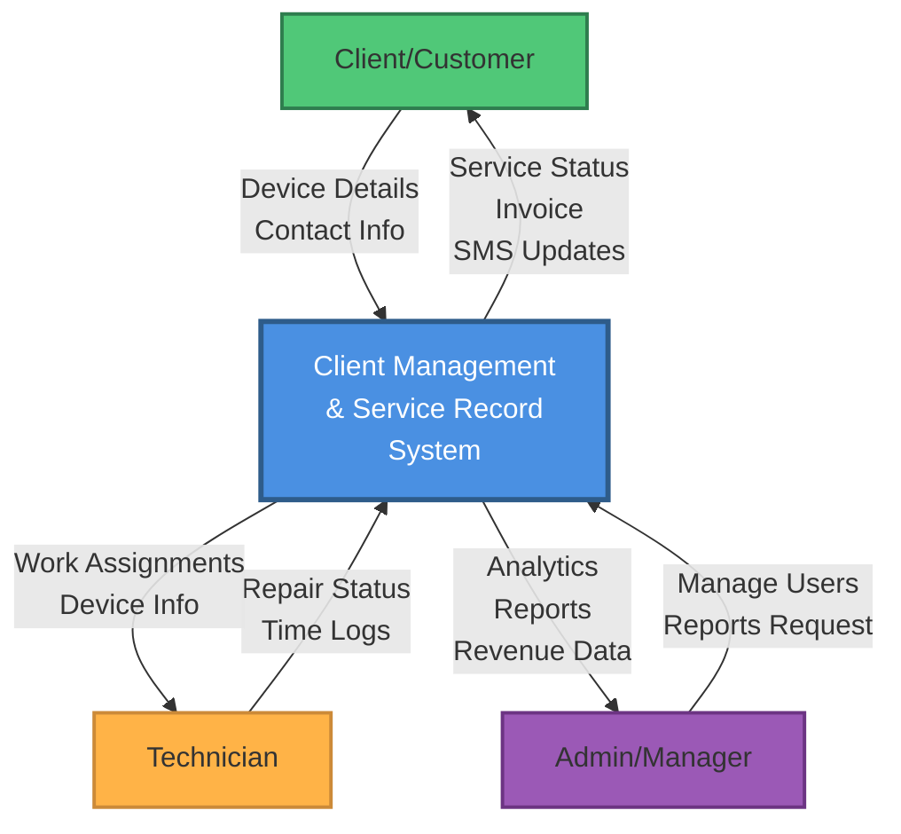
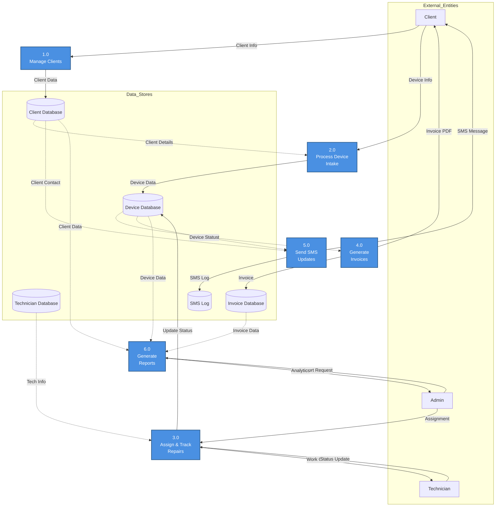
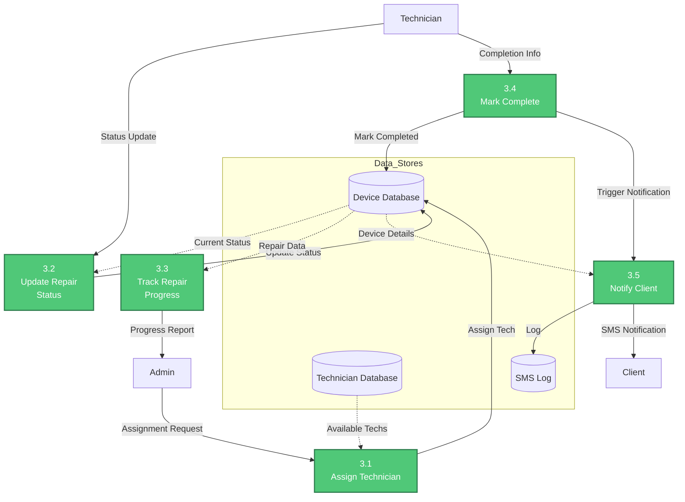

# Client Management & Service Record System
## Data Flow Diagrams (DFD)

### Context Diagram (Level 0)

### Level 1 DFD - Main Processes

### Level 2 DFD - Device Repair Process (Process 3.0)

---

## How to View Diagrams

These diagrams use Mermaid syntax. To view them:

1. **GitHub**: Automatically renders in .md files
2. **VS Code**: Install "Markdown Preview Mermaid Support" extension
3. **Online**: Use https://mermaid.live/
4. **Export**: Use mermaid-cli to export as PNG/SVG

## Diagram Descriptions

### Context Diagram
Shows the system boundary and external entities (Clients, Technicians, Admin) interacting with the system.

### Level 1 DFD
Breaks down the system into 6 major processes:
1. Manage Clients
2. Process Device Intake
3. Assign & Track Repairs
4. Generate Invoices
5. Send SMS Updates
6. Generate Reports

### Level 2 DFD (Device Repair Process)
Detailed breakdown of the repair workflow showing how technicians are assigned, status is tracked, and clients are notified.
