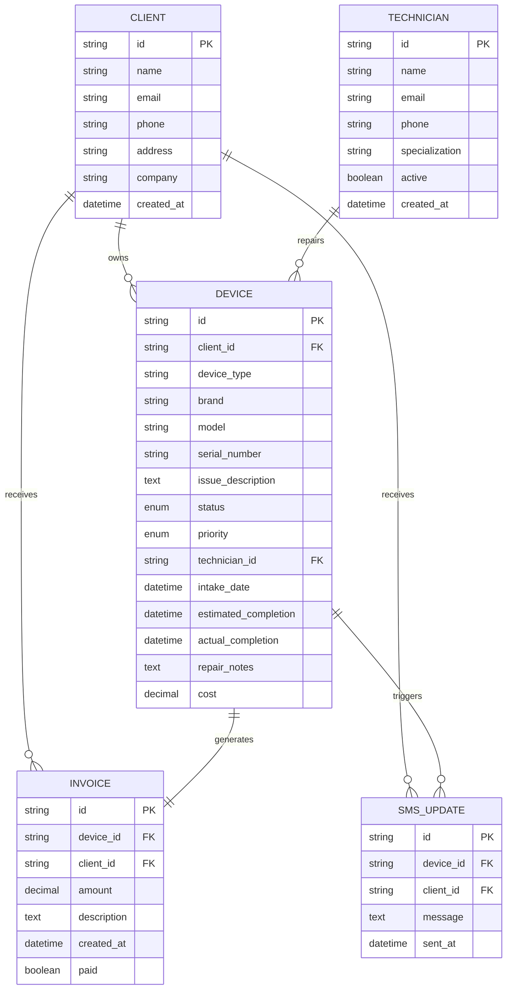

# Client Management & Service Record System
## Entity Relationship Diagram (ERD)



## ERD Detailed Description

### Entities and Attributes

#### CLIENT
- **Primary Key**: id
- **Attributes**:
  - name: Full name (Bangladesh region names)
  - email: Email address (.bd domains supported)
  - phone: Contact number (+880 Bangladesh code)
  - address: Physical address (Dhaka, Chittagong locations)
  - company: Company name (optional)
  - created_at: Registration timestamp

#### TECHNICIAN
- **Primary Key**: id
- **Attributes**:
  - name: Technician name
  - email: Work email (.bd domains)
  - phone: Contact number (+880)
  - specialization: Area of expertise
  - active: Employment status
  - created_at: Hire date

#### DEVICE
- **Primary Key**: id
- **Foreign Keys**: 
  - client_id → CLIENT.id
  - technician_id → TECHNICIAN.id
- **Attributes**:
  - device_type: Type (Laptop, Phone, Tablet, etc.)
  - brand: Manufacturer
  - model: Model name/number
  - serial_number: Unique device identifier
  - issue_description: Problem details
  - status: pending | in_progress | completed | delivered
  - priority: low | medium | high | urgent
  - intake_date: When device was received
  - estimated_completion: Expected completion date
  - actual_completion: Actual completion date
  - repair_notes: Technical notes
  - cost: Repair cost in BDT

#### INVOICE
- **Primary Key**: id
- **Foreign Keys**:
  - device_id → DEVICE.id
  - client_id → CLIENT.id
- **Attributes**:
  - amount: Invoice amount (BDT)
  - description: Service description
  - created_at: Invoice generation date
  - paid: Payment status

#### SMS_UPDATE
- **Primary Key**: id
- **Foreign Keys**:
  - device_id → DEVICE.id
  - client_id → CLIENT.id
- **Attributes**:
  - message: SMS content
  - sent_at: Timestamp

### Relationships

1. **CLIENT to DEVICE** (One-to-Many)
   - A client can own multiple devices
   - Each device belongs to one client

2. **TECHNICIAN to DEVICE** (One-to-Many)
   - A technician can repair multiple devices
   - Each device is assigned to one technician (or none)

3. **DEVICE to INVOICE** (One-to-One)
   - Each device generates one invoice
   - Each invoice is for one device

4. **CLIENT to INVOICE** (One-to-Many)
   - A client can have multiple invoices
   - Each invoice belongs to one client

5. **DEVICE to SMS_UPDATE** (One-to-Many)
   - A device can trigger multiple SMS updates
   - Each SMS is related to one device

6. **CLIENT to SMS_UPDATE** (One-to-Many)
   - A client can receive multiple SMS updates
   - Each SMS is sent to one client

### Cardinality Summary

| Relationship | Type | Description |
|-------------|------|-------------|
| CLIENT → DEVICE | 1:N | One client owns many devices |
| TECHNICIAN → DEVICE | 1:N | One technician repairs many devices |
| DEVICE → INVOICE | 1:1 | One device generates one invoice |
| CLIENT → INVOICE | 1:N | One client receives many invoices |
| DEVICE → SMS_UPDATE | 1:N | One device triggers many SMS updates |
| CLIENT → SMS_UPDATE | 1:N | One client receives many SMS updates |

### Database Normalization

The schema is in **Third Normal Form (3NF)**:
- ✅ All attributes are atomic (1NF)
- ✅ No partial dependencies (2NF)
- ✅ No transitive dependencies (3NF)

### Indexes Recommendation

For optimal performance:
```sql
-- Primary Keys (automatic)
CREATE INDEX idx_client_id ON CLIENT(id);
CREATE INDEX idx_device_id ON DEVICE(id);
CREATE INDEX idx_technician_id ON TECHNICIAN(id);
CREATE INDEX idx_invoice_id ON INVOICE(id);

-- Foreign Keys
CREATE INDEX idx_device_client ON DEVICE(client_id);
CREATE INDEX idx_device_technician ON DEVICE(technician_id);
CREATE INDEX idx_invoice_device ON INVOICE(device_id);
CREATE INDEX idx_invoice_client ON INVOICE(client_id);
CREATE INDEX idx_sms_device ON SMS_UPDATE(device_id);
CREATE INDEX idx_sms_client ON SMS_UPDATE(client_id);

-- Common Queries
CREATE INDEX idx_device_status ON DEVICE(status);
CREATE INDEX idx_device_priority ON DEVICE(priority);
CREATE INDEX idx_invoice_paid ON INVOICE(paid);
CREATE INDEX idx_technician_active ON TECHNICIAN(active);
```
