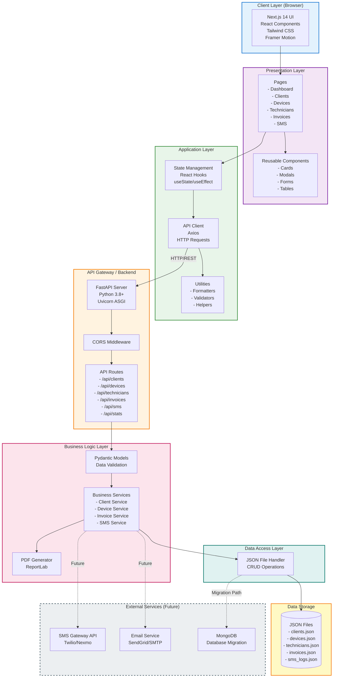

# Client Management & Service Record System
## System Architecture



## Architecture Layers Description

### 1. Client Layer (Browser)
**Technology**: Next.js 14, React 19, TypeScript
- **Rendering**: Server-side rendering (SSR) + Client-side rendering (CSR)
- **Styling**: Tailwind CSS 4 with custom corporate theme
- **Animations**: Framer Motion for smooth transitions
- **Icons**: Lucide React icon library
- **Routing**: Next.js App Router (file-based routing)

### 2. Presentation Layer
**Components**:
- **Pages**: Route-based page components
  - Dashboard (/)
  - Clients (/clients)
  - Devices (/devices)
  - Technicians (/technicians)
  - Invoices (/invoices)
  - SMS Updates (/sms)
- **Reusable Components**:
  - Card, Modal, Button, Input components
  - Header, Sidebar navigation
  - Loading spinners, Badges

### 3. Application Layer
**State Management**:
- React Hooks (useState, useEffect)
- Client-side data caching
- Form validation

**API Integration**:
- Axios HTTP client
- RESTful API communication
- Error handling and retries

**Utilities**:
- Date formatting (date-fns)
- Currency formatting
- Class name utilities (clsx, tailwind-merge)
- ID generation

### 4. API Gateway / Backend
**Technology**: FastAPI (Python), Uvicorn
- **Framework**: FastAPI 0.104.1
- **ASGI Server**: Uvicorn with WebSockets support
- **CORS**: Enabled for cross-origin requests
- **Documentation**: Auto-generated OpenAPI/Swagger docs at /docs
- **Validation**: Automatic request/response validation

**Endpoints**:
```
GET    /api/clients          - List all clients
POST   /api/clients          - Create client
GET    /api/clients/{id}     - Get client by ID
PUT    /api/clients/{id}     - Update client
DELETE /api/clients/{id}     - Delete client

GET    /api/devices          - List all devices
POST   /api/devices          - Create device
PUT    /api/devices/{id}     - Update device status
DELETE /api/devices/{id}     - Delete device

GET    /api/technicians      - List technicians
POST   /api/technicians      - Create technician
PUT    /api/technicians/{id} - Update technician
DELETE /api/technicians/{id} - Delete technician

GET    /api/invoices         - List invoices
POST   /api/invoices         - Create invoice
GET    /api/invoices/{id}/pdf - Download invoice PDF

POST   /api/sms/send         - Send SMS update
GET    /api/sms/logs         - Get SMS history

GET    /api/stats            - Dashboard statistics
```

### 5. Business Logic Layer
**Models** (Pydantic):
- Client, Device, Technician, Invoice, SMSUpdate
- Data validation and serialization
- Type hints and schemas

**Services**:
- Business rules enforcement
- Data transformation
- Validation logic
- PDF generation (ReportLab)

### 6. Data Access Layer
**JSON File Handler**:
- File-based CRUD operations
- Thread-safe read/write operations
- Data persistence to JSON files
- Automatic file creation

### 7. Data Storage
**Current**: JSON Files
```
backend/data/
├── clients.json       - Client records
├── devices.json       - Device records
├── technicians.json   - Technician records
├── invoices.json      - Invoice records
└── sms_logs.json     - SMS history
```

**Future**: MongoDB migration path ready
- Schema-compatible with MongoDB
- Easy migration with minimal code changes

### 8. External Services (Future Integration)
**Planned Integrations**:
- **SMS Gateway**: Twilio/Nexmo for real SMS
- **Email**: SendGrid/SMTP for notifications
- **Database**: MongoDB for scalability
- **Cloud Storage**: AWS S3 for file uploads
- **Payment**: Stripe/bKash for online payments

## Technology Stack

### Frontend
| Category | Technology | Version |
|----------|-----------|---------|
| Framework | Next.js | 16.0.3 |
| Language | TypeScript | 5.x |
| UI Library | React | 19.2.0 |
| Styling | Tailwind CSS | 4.x |
| Animation | Framer Motion | 12.23.24 |
| Icons | Lucide React | 0.553.0 |
| HTTP Client | Axios | 1.13.2 |
| Date Utils | date-fns | 4.1.0 |

### Backend
| Category | Technology | Version |
|----------|-----------|---------|
| Framework | FastAPI | 0.104.1 |
| Server | Uvicorn | 0.24.0 |
| Language | Python | 3.8+ |
| Validation | Pydantic | 2.5.0 |
| PDF | ReportLab | 4.0.7 |
| CORS | starlette | 0.27.0 |

## Deployment Architecture


## Security Considerations

1. **CORS Configuration**: Allows frontend origin only
2. **Input Validation**: Pydantic models validate all inputs
3. **SQL Injection**: Not applicable (JSON storage)
4. **XSS Protection**: React escapes output by default
5. **CSRF**: Token-based protection (future)
6. **HTTPS**: Required in production
7. **Rate Limiting**: To be implemented

## Scalability Features

1. **Stateless Backend**: Easy horizontal scaling
2. **CDN Integration**: Static assets cached
3. **Database Ready**: MongoDB migration path
4. **Microservices**: Can split into separate services
5. **Load Balancing**: Multiple backend instances
6. **Caching**: Redis integration ready

## Performance Optimizations

1. **Frontend**:
   - Code splitting (Next.js automatic)
   - Image optimization
   - Lazy loading components
   - Memoization (React.memo)

2. **Backend**:
   - Async operations (FastAPI)
   - Connection pooling (future with MongoDB)
   - Response caching
   - Gzip compression

3. **Network**:
   - HTTP/2 support
   - CDN for static assets
   - API response compression
   - Efficient JSON serialization
