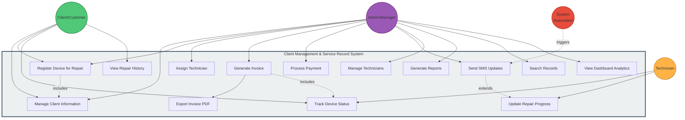

# Client Management & Service Record System
## Use Case Diagram

## Use Case Descriptions

### Actor Definitions

#### 1. Client/Customer
**Description**: End-user who owns devices requiring repair
**Responsibilities**:
- Submit devices for repair
- Provide contact information
- Check repair status
- Receive updates via SMS
- Review repair history

#### 2. Technician
**Description**: Technical staff who performs repairs
**Responsibilities**:
- View assigned work orders
- Update repair progress
- Mark devices as completed
- Add technical notes
- Track time spent

#### 3. Admin/Manager
**Description**: System administrator managing operations
**Responsibilities**:
- Full system access
- Manage all entities (clients, devices, technicians)
- Assign work to technicians
- Generate invoices and reports
- Send SMS notifications
- View analytics

#### 4. System (Automated)
**Description**: Automated system processes
**Responsibilities**:
- Trigger automatic notifications
- Generate scheduled reports
- Auto-calculate statistics
- Enforce business rules

---

### Use Cases Detail

#### UC1: Manage Client Information
**Actor**: Client, Admin
**Description**: Create, read, update, delete client records
**Preconditions**: User has system access
**Main Flow**:
1. Admin/Client accesses client management
2. System displays client list
3. User selects action (Add/Edit/Delete)
4. System validates input
5. System saves changes
6. System confirms success

**Postconditions**: Client data updated in database

**Business Rules**:
- Email must be unique
- Phone number must be valid Bangladesh format (+880)
- All required fields must be filled

---

#### UC2: Register Device for Repair
**Actor**: Client, Admin
**Description**: Submit a device for repair service
**Preconditions**: Client exists in system
**Main Flow**:
1. User selects "Add Device"
2. System displays intake form
3. User enters device details:
   - Device type, brand, model
   - Issue description
   - Priority level
4. System validates input
5. System creates device record
6. System generates device ID
7. System sends confirmation SMS

**Postconditions**: Device registered with "pending" status

**Includes**: UC1 (client must exist)

**Business Rules**:
- Device must be linked to existing client
- Initial status is always "pending"
- Priority affects queue position

---

#### UC3: Track Device Status
**Actor**: Client, Technician, Admin
**Description**: View current status of device repair
**Preconditions**: Device registered in system
**Main Flow**:
1. User searches for device
2. System displays device details
3. System shows:
   - Current status
   - Assigned technician
   - Estimated completion
   - Repair notes
   - Cost estimate

**Postconditions**: User informed of status

**Alternative Flow**:
- If device not found, show error message

---

#### UC4: Assign Technician
**Actor**: Admin
**Description**: Assign repair work to available technician
**Preconditions**: 
- Device in "pending" status
- Technician available and active
**Main Flow**:
1. Admin views pending devices
2. Admin selects device
3. System shows available technicians by specialization
4. Admin assigns technician
5. System updates device status to "in_progress"
6. System notifies technician
7. System sends SMS to client

**Postconditions**: Device assigned to technician

**Business Rules**:
- Only active technicians can be assigned
- Prefer technicians matching device specialization
- Workload balancing recommended

---

#### UC5: Update Repair Progress
**Actor**: Technician
**Description**: Update device repair status and add notes
**Preconditions**: 
- Device assigned to technician
- Technician logged in
**Main Flow**:
1. Technician views assigned devices
2. Technician selects device
3. Technician updates:
   - Status (in_progress/completed)
   - Repair notes
   - Cost estimate
   - Completion date
4. System validates changes
5. System saves update
6. System triggers SMS notification (if status changed)

**Postconditions**: Device status updated

**Extends**: UC8 (SMS sent on status change)

---

#### UC6: Generate Invoice
**Actor**: Admin
**Description**: Create invoice for completed repair
**Preconditions**: Device status is "completed"
**Main Flow**:
1. Admin selects completed device
2. System auto-populates invoice:
   - Client details
   - Device details
   - Repair description
   - Cost
3. Admin reviews and confirms
4. System generates invoice ID
5. System saves invoice
6. System marks invoice as "unpaid"

**Postconditions**: Invoice created

**Includes**: UC3 (device status checked)

---

#### UC7: Process Payment
**Actor**: Admin
**Description**: Mark invoice as paid
**Preconditions**: Invoice exists
**Main Flow**:
1. Admin views invoice
2. Admin confirms payment received
3. Admin marks as "paid"
4. System updates invoice status
5. System updates revenue statistics
6. System can trigger receipt SMS

**Postconditions**: Invoice marked paid, revenue updated

---

#### UC8: Send SMS Updates
**Actor**: Admin, System (Automated)
**Description**: Send status update to client via SMS
**Preconditions**: 
- Client has valid phone number
- Device exists
**Main Flow**:
1. Admin/System triggers SMS
2. System retrieves client phone
3. System generates message template based on status
4. System logs SMS
5. System simulates SMS send (future: actual API)

**Postconditions**: SMS logged

**Extends**: UC5 (auto-triggered on status change)

---

#### UC9: View Repair History
**Actor**: Client
**Description**: View past repairs and invoices
**Preconditions**: Client registered
**Main Flow**:
1. Client logs in / provides ID
2. System retrieves client's devices
3. System displays:
   - All devices
   - Repair history
   - Invoices
   - SMS history
4. Client can view details

**Postconditions**: History displayed

---

#### UC10: Manage Technicians
**Actor**: Admin
**Description**: Add, edit, or remove technicians
**Preconditions**: Admin access
**Main Flow**:
1. Admin accesses technician management
2. Admin performs action (Add/Edit/Delete)
3. System validates input
4. System updates technician record
5. For deletion, system checks for assigned devices
6. System confirms changes

**Postconditions**: Technician roster updated

**Business Rules**:
- Cannot delete technician with active assignments
- Email must be unique
- Can deactivate instead of delete

---

#### UC11: Generate Reports
**Actor**: Admin
**Description**: Create analytical reports
**Preconditions**: Data exists in system
**Main Flow**:
1. Admin selects report type:
   - Revenue report
   - Technician performance
   - Device status summary
   - Client activity
2. Admin sets date range
3. System aggregates data
4. System generates report
5. System displays/exports report

**Postconditions**: Report generated

---

#### UC12: Export Invoice PDF
**Actor**: Admin, Client
**Description**: Download invoice as PDF file
**Preconditions**: Invoice exists
**Main Flow**:
1. User selects invoice
2. User clicks "Download PDF"
3. System generates PDF using ReportLab
4. System includes:
   - Invoice details
   - Client info
   - Device info
   - Itemized costs
   - Company branding
5. System returns PDF file

**Postconditions**: PDF downloaded

**Included by**: UC6

---

#### UC13: Search Records
**Actor**: Admin
**Description**: Search across clients, devices, invoices
**Preconditions**: User logged in
**Main Flow**:
1. User enters search query
2. System searches across:
   - Client names, emails, phones
   - Device brands, models
   - Invoice IDs
3. System displays results
4. User selects result for details

**Postconditions**: Relevant records displayed

---

#### UC14: View Dashboard Analytics
**Actor**: Admin
**Description**: View system statistics and KPIs
**Preconditions**: Admin access
**Main Flow**:
1. Admin opens dashboard
2. System calculates real-time stats:
   - Total clients
   - Active devices
   - Revenue (total, pending)
   - Device status breakdown
   - Recent activity
3. System displays visualizations
4. System shows recent clients/devices

**Postconditions**: Dashboard displayed

---

## Use Case Relationships

### Includes Relationships
- **UC2 includes UC1**: Device registration requires client existence
- **UC6 includes UC3**: Invoice generation requires device status

### Extends Relationships
- **UC8 extends UC5**: SMS notification triggered by status update

### Generalizations
- All use cases generalize from "System Usage"
- CRUD operations generalize from "Data Management"

---

## Use Case Priority Matrix

| Use Case | Priority | Frequency | Complexity |
|----------|----------|-----------|------------|
| UC1 - Manage Clients | High | Medium | Low |
| UC2 - Register Device | High | High | Medium |
| UC3 - Track Status | High | High | Low |
| UC4 - Assign Technician | High | High | Medium |
| UC5 - Update Progress | High | High | Medium |
| UC6 - Generate Invoice | High | Medium | Medium |
| UC7 - Process Payment | High | Medium | Low |
| UC8 - Send SMS | Medium | High | Low |
| UC9 - View History | Medium | Medium | Low |
| UC10 - Manage Technicians | Medium | Low | Low |
| UC11 - Generate Reports | Medium | Low | High |
| UC12 - Export PDF | Medium | Medium | Medium |
| UC13 - Search Records | High | High | Medium |
| UC14 - View Dashboard | High | High | Low |

---

## Business Rules Summary

1. **Client Management**
   - Unique email per client
   - Bangladesh phone format (+880)
   - Required fields: name, email, phone, address

2. **Device Management**
   - Must link to existing client
   - Status workflow: pending → in_progress → completed → delivered
   - Priority levels affect service queue
   - Cannot delete device with unpaid invoice

3. **Technician Assignment**
   - Only active technicians can receive assignments
   - Specialization matching preferred
   - Workload balancing recommended

4. **Invoicing**
   - One invoice per device
   - Auto-generated from device cost
   - Payment tracking (paid/unpaid)
   - PDF export available

5. **SMS Notifications**
   - Auto-triggered on status changes
   - Manual sending available
   - All SMS logged for audit
   - Template-based messages

6. **Access Control**
   - Admin: Full access
   - Technician: Limited to assigned devices
   - Client: View own data only
